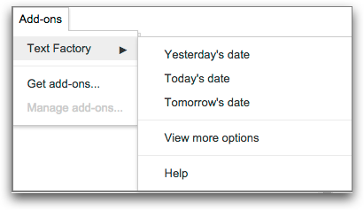
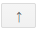
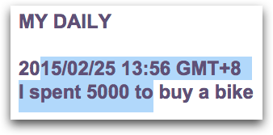
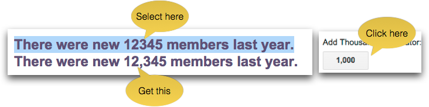
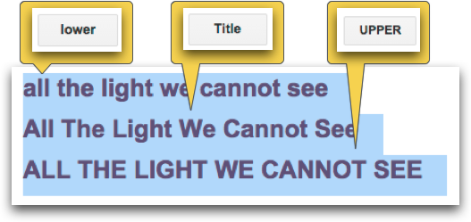
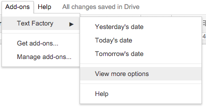

--------

\ |LINK1|\ 

--------

.. _h314f6e27113755755fb2358b7d3d65:

Text Factory Help
*****************

Version 2015/2/26

By Yeh, Hsin Yuan

.. toctree:: 
    :maxdepth: 2

    index_zh_TW

This idea of this google-doc add-on is to save users time by providing several text utilities. With this add-on, users can insert datetime from the pulldown menu directly. It also helps users to add parentheses to selection, add thousands separators to numbers and do conversion between width form of fonts. The datetime format is customizable. It can be used in different cultural context.

.. _he53612f1f39167562133222e366441:

Release Note (Mar 5, 2016)
==========================

    A new version has been updated.

    You can now add a “*” in the format to remove the leading zero. For example, if “%d” yields “02”, then the “%*d” would be “2”. This is also valid for %h, %j, %m,...ect.

.. _h2e5d756ef165210291d424e27125c71:

Insert Date
===========

Inserts the datetime into the document.

.. _h68126c6c7c573911424f1c423561e:

From Menu Item
--------------

.. _h761ab401543201137a78553757464:

\ |IMG1|\ ==========

    You may insert the datetime from the pull-down menu. You have three choices: Yesterday, Today and Tomorrow. Just select the item, the respective datetime value will insert to the document at the cursor position.

    You may change the format of these values by moving up your favorite format item to top in the formats list. You can find the format list in the “Format Editing Form” in sidebar. See “Format Editing” below for details.

.. _h29425c7f697f6b725e2a452f46307b4e:

From Sidebar
------------

\ |IMG2|\ 

    You can bring up the sidebar by the “View more options” menuitem. 

    The “Select Day” is for changing the base day to “yesterday” or “tomorrow” from the default value “ today”.

    The “Select Format” is for choosing proper datetime format in context to insert.

    By clicking on the blue “Insert” button. The item content on the above Selected Format will be inserted into the document.

.. _h64a84323c24d6b105b4427161b2e:

Format Editing
--------------

\ |IMG3|\ 

    By clicking on “Edit Format” \ |IMG4|\     button, the Format Editing Form would show up.

    The selected format item\ |IMG5|\      would appear in the text field

\ |IMG7|\ 

    You may delete the selected format by the \ |IMG8|\     button on the right. But you can not delete them all. If there is only one format left on the list, it can not be deleted.

    You may sort the formats by the \ |IMG9|\ \ |IMG10|\ 
    buttons.  The top format will be used for the three menuitems to generate their datetime value.

    The last item “New Format”\ |IMG11|\      is for adding new format. Just click on this item, then input new format in the text field

.. _h6e29567e5c3e732671b27234d1f19:

Format Text
===========

\ |IMG13|\ 

The functions on this section are applied to text selection. You have to select some text before proceeding. Like this:

\ |IMG14|\ 

.. _h33d6a1d3159173321261d463063536a:

Put into Parentheses
--------------------

    This function add paired symbols to your text selection. For example:

\ |IMG15|\ 

    These are options that you can use to encapsulate your selection. Just click on your favorite symbol to make it happen.

\ |IMG16|\ 

.. _h40f15614e694f744f4c7410d7a7221:

Add Thousands Separator
-----------------------

    This function adds thousands separators into your selection. Only the numbers in the selection would be applied.

.. _h3248231c6e2d557827121a17741e487e:

\ |IMG17|\ ===========

.. _h1517781f5a4a4d603c1b391a14342f58:

Convert Letter Case
-------------------

    This function converts the letter case in the selection. There are three options: “lower” button converts all alphabets to lowercase, “Title” button converts the first letter to uppercase and the others to lowercase, “UPPER” button converts all alphabets to uppercase.

\ |IMG18|\ 

.. _h2c1d74277104e41780968148427e:

.. _he284078c5f234e1fc4636e11714a:

Conversion of Fullwidth/Halfwidth
---------------------------------

    This function converts the selection between fullwidth and halfwidth form. The fullwidth and halfwidth form is a symbol in two kinds of writing style. The fullwidth form is visually double width than the halfwidth one, in fact, these two are different unicode characters. Below are some characters of halfwidth and fullwidth.

\ |IMG19|\ 

.. _h3f345a39e3924697d39503864754036:

Conversion of Fullwidth/Halfwidth Punctuations
----------------------------------------------

    This function is only available for CJK locale. In context of punctuations, the mappings between fullwidth and halfwidth forms are different. For example, the halfwidth full stop “.” should maps to “。”, not “\ |STYLE0|\ ”(this is what the above “Conversion of Fullwidth/Halfwidth” does). This function only converts punctuation symbols in CJK writing traditions. Below is the mapping table of the punctuation conversion:

+-------------+-------------+-------------+-------------+
|\ |STYLE1|\  |             |\ |STYLE2|\  |             |
+-------------+-------------+-------------+-------------+
|\ |STYLE3|\  |\ |STYLE4|\  |\ |STYLE5|\  |\ |STYLE6|\  |
+-------------+-------------+-------------+-------------+
|\ |STYLE7|\  |\ |STYLE8|\  |\ |STYLE9|\  |\ |STYLE10|\ |
+-------------+-------------+-------------+-------------+
|\ |STYLE11|\ |\ |STYLE12|\ |\ |STYLE13|\ |\ |STYLE14|\ |
+-------------+-------------+-------------+-------------+
|\ |STYLE15|\ |\ |STYLE16|\ |\ |STYLE17|\ |\ |STYLE18|\ |
+-------------+-------------+-------------+-------------+
|\ |STYLE19|\ |\ |STYLE20|\ |\ |STYLE21|\ |\ |STYLE22|\ |
+-------------+-------------+-------------+-------------+
|\ |STYLE23|\ |\ |STYLE24|\ |\ |STYLE25|\ |\ |STYLE26|\ |
+-------------+-------------+-------------+-------------+
|\ |STYLE27|\ |\ |STYLE28|\ |\ |STYLE29|\ |\ |STYLE30|\ |
+-------------+-------------+-------------+-------------+
|\ |STYLE31|\ |\ |STYLE32|\ |\ |STYLE33|\ |\ |STYLE34|\ |
+-------------+-------------+-------------+-------------+
|\ |STYLE35|\ |\ |STYLE36|\ |\ |STYLE37|\ |\ |STYLE38|\ |
+-------------+-------------+-------------+-------------+
|\ |STYLE39|\ |\ |STYLE40|\ |\ |STYLE41|\ |\ |STYLE42|\ |
+-------------+-------------+-------------+-------------+
|\ |STYLE43|\ |\ |STYLE44|\ |\ |STYLE45|\ |\ |STYLE46|\ |
+-------------+-------------+-------------+-------------+
|\ |STYLE47|\ |\ |STYLE48|\ |\ |STYLE49|\ |\ |STYLE50|\ |
+-------------+-------------+-------------+-------------+
|\ |STYLE51|\ |\ |STYLE52|\ |\ |STYLE53|\ |\ |STYLE54|\ |
+-------------+-------------+-------------+-------------+
|\ |STYLE55|\ |\ |STYLE56|\ |\ |STYLE57|\ |\ |STYLE58|\ |
+-------------+-------------+-------------+-------------+
|\ |STYLE59|\ |\ |STYLE60|\ |\ |STYLE61|\ |\ |STYLE62|\ |
+-------------+-------------+-------------+-------------+
|\ |STYLE63|\ |\ |STYLE64|\ |\ |STYLE65|\ |\ |STYLE66|\ |
+-------------+-------------+-------------+-------------+
|\ |STYLE67|\ |\ |STYLE68|\ |\ |STYLE69|\ |\ |STYLE70|\ |
+-------------+-------------+-------------+-------------+
|             |             |\ |STYLE71|\ |\ |STYLE72|\ |
+-------------+-------------+-------------+-------------+
|             |             |\ |STYLE73|\ |\ |STYLE74|\ |
+-------------+-------------+-------------+-------------+
|             |             |\ |STYLE75|\ |\ |STYLE76|\ |
+-------------+-------------+-------------+-------------+

    

.. _h46313855313c357028733469a157d35:

Step-by-Step: How to know what’s wrong by the Chrome Console.
-------------------------------------------------------------

#. Open the Chrome and a Google Docs Document.
#. Open the sidebar of the TextFactory by “View more options”

\ |IMG20|\ 

#. In the sidebar, click the “Edit Format” button on the lower right.

\ |IMG21|\ Then, it would be:

#. Open the javascript console with keyboard shortcut:

    \ |STYLE77|\  

    4.1 For MS Windows users, please open the developer tool  by Ctrl+Shift+J , then click on the tab of “Console”, it would something like this:

\ |IMG23|\ 

    4.2 For Mac OS users, please open the developer tool  by ⌘+Option+J , then click on the tab of “Console”, it would something like this:

\ |IMG24|\ 

#. If something goes wrong, the Google Chrome would drop its complains on the javascript console, like this:

\ |IMG25|\ 

#. please take a screenshot of the console which includes the message on the console as much as possible. 
#. Appreciation! it’s all. Please mail the screenshots to me at \ |LINK2|\  

\ |STYLE78|\ \ |LINK3|\ 

\ |STYLE79|\ \ |LINK4|\ 

.. |STYLE0| replace:: **．**

.. |STYLE1| replace:: **Halfwidth To Fullwidth**

.. |STYLE2| replace:: **Fullwidth To Halfwidth**

.. |STYLE3| replace:: **‘**

.. |STYLE4| replace:: **‘**

.. |STYLE5| replace:: **‘**

.. |STYLE6| replace:: **'**

.. |STYLE7| replace:: **“**

.. |STYLE8| replace:: **“**

.. |STYLE9| replace:: **“**

.. |STYLE10| replace:: **"**

.. |STYLE11| replace:: **{T}**

.. |STYLE12| replace:: **｛T｝**

.. |STYLE13| replace:: **｛T｝**

.. |STYLE14| replace:: **{T}**

.. |STYLE15| replace:: **(T)**

.. |STYLE16| replace:: **（T）**

.. |STYLE17| replace:: **（T）**

.. |STYLE18| replace:: **(T)**

.. |STYLE19| replace:: **[T]**

.. |STYLE20| replace:: **［T］**

.. |STYLE21| replace:: **［T］**

.. |STYLE22| replace:: **[T]**

.. |STYLE23| replace:: **[[T]]**

.. |STYLE24| replace:: **『T』**

.. |STYLE25| replace:: **『T』**

.. |STYLE26| replace:: **[[T]]**

.. |STYLE27| replace:: **,**

.. |STYLE28| replace:: **，**

.. |STYLE29| replace:: **，**

.. |STYLE30| replace:: **,**

.. |STYLE31| replace:: **.**

.. |STYLE32| replace:: **。**

.. |STYLE33| replace:: **。**

.. |STYLE34| replace:: **.**

.. |STYLE35| replace:: **..**

.. |STYLE36| replace:: **‥**

.. |STYLE37| replace:: **‥**

.. |STYLE38| replace:: **..**

.. |STYLE39| replace:: **...**

.. |STYLE40| replace:: **…**

.. |STYLE41| replace:: **…**

.. |STYLE42| replace:: **...**

.. |STYLE43| replace:: **<T>**

.. |STYLE44| replace:: **〈T〉**

.. |STYLE45| replace:: **〈T〉**

.. |STYLE46| replace:: **<T>**

.. |STYLE47| replace:: **<<T>>**

.. |STYLE48| replace:: **《T》**

.. |STYLE49| replace:: **《T》**

.. |STYLE50| replace:: **<<T>>**

.. |STYLE51| replace:: **!**

.. |STYLE52| replace:: **！**

.. |STYLE53| replace:: **！**

.. |STYLE54| replace:: **!**

.. |STYLE55| replace:: **?**

.. |STYLE56| replace:: **？**

.. |STYLE57| replace:: **？**

.. |STYLE58| replace:: **?**

.. |STYLE59| replace:: **:**

.. |STYLE60| replace:: **：**

.. |STYLE61| replace:: **：**

.. |STYLE62| replace:: **:**

.. |STYLE63| replace:: **-**

.. |STYLE64| replace:: **—**

.. |STYLE65| replace:: **—**

.. |STYLE66| replace:: **-**

.. |STYLE67| replace:: **;**

.. |STYLE68| replace:: **；**

.. |STYLE69| replace:: **；**

.. |STYLE70| replace:: **;**

.. |STYLE71| replace:: **、**

.. |STYLE72| replace:: **､**

.. |STYLE73| replace:: **－**

.. |STYLE74| replace:: **-**

.. |STYLE75| replace:: **—**

.. |STYLE76| replace:: **-**

.. |STYLE77| replace:: **[Before you are going to press on the keyboard, please mouse-click on any empty area in the sidebar again to make sure the sidebar being the focus frame.]**

.. |STYLE78| replace:: **If you have any question about the console, you may consult this document of Google:**

.. |STYLE79| replace:: **Welcome any suggestion and comments. Contacts:**

.. |LINK1| raw:: html

    <a href="index_zh_TW.html">繁體中文版</a>

.. |LINK2| raw:: html

    <a href="mailto:iapyeh@gmail.com">iapyeh@gmail.com</a>

.. |LINK3| raw:: html

    <a href="https://developer.chrome.com/devtools/docs/console" target="_blank">https://developer.chrome.com/devtools/docs/console</a>

.. |LINK4| raw:: html

    <a href="mailto:iapyeh@gmail.com">iapyeh＠gmail.com</a>

.. |IMG2| image:: static/index_2.png
   :height: 332 px
   :width: 325 px

.. |IMG3| image:: static/index_3.png
   :height: 437 px
   :width: 310 px

.. |IMG4| image:: static/index_4.png
   :height: 37 px
   :width: 92 px

.. |IMG5| image:: static/index_5.png
   :height: 30 px
   :width: 29 px

.. |IMG6| image:: static/index_6.png
   :height: 33 px
   :width: 32 px

.. |IMG7| image:: static/index_7.png
   :height: 364 px
   :width: 309 px

.. |IMG8| image:: static/index_8.png
   :height: 21 px
   :width: 26 px

.. |IMG10| image:: static/index_10.png
   :height: 21 px
   :width: 26 px

.. |IMG13| image:: static/index_13.png
   :height: 510 px
   :width: 325 px

.. |IMG15| image:: static/index_15.png
   :height: 202 px
   :width: 697 px

.. |IMG16| image:: static/index_16.png
   :height: 150 px
   :width: 272 px

.. |IMG19| image:: static/index_19.png
   :height: 92 px
   :width: 589 px

.. |IMG21| image:: static/index_21.png
   :height: 241 px
   :width: 232 px

.. |IMG22| image:: static/index_22.png
   :height: 549 px
   :width: 258 px

.. |IMG23| image:: static/index_23.png
   :height: 94 px
   :width: 600 px

.. |IMG24| image:: static/index_24.png
   :height: 196 px
   :width: 598 px

.. |IMG25| image:: static/index_25.png
   :height: 305 px
   :width: 556 px
