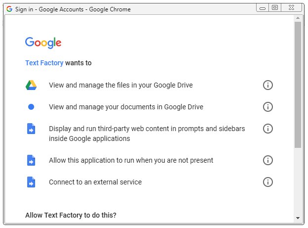

.. _h71621f476335c43351319f35535154:

Why TextFactory manges your files?
##################################

.. _h749d5b2426674c1b23471818355b3c:

The warning prompt by Google
****************************

Everyone was asked before installing the TextFactory:

\ |IMG1|\ 

You might wounder why? Let me tell the truth: I don't know why neither.

The above dialog is shown by the Google. Me, the author of the TextFactory, does not make explicitly any request to ask for those permissions.

.. _hf40273c592d796d27337f192c7b1:

Statements of the author
************************

My statements are:

* The TextFactory does not manage files in your Google Drive.

* The TextFactory does not manage documents in your Google Drive.

* The TextFactory does display and run third-party web content in prompts and sidebars inside Google applications.

    * Sure, it is an add-on of the Google docs.

* The TextFactory does not run when you are not present.

* The TextFactory does not connect to any extenal service. All the source codes are hosted by the Google Doc's add-on system. And all the communication goes between your browser and Google Docs server.

    * One suspecious reason for this warnning message is that for getting Hebrew date, it requests Heberw calendar from \ |LINK1|\  

.. _h3e5e3c80415d5e141947243b1654547b:

Source code is open accessible
******************************

For the above statement  to be sincerely,  you can see all \ |LINK2|\ .

Yeh, Hsin Yuan @ 2018-02-09

.. bottom of content

.. |LINK1| raw:: html

    <a href="www.hebcal.com">the API of www.hebcal.com</a>

.. |LINK2| raw:: html

    <a href="https://github.com/iapyeh/TextFactory/tree/master/source" target="_blank">the source code of the TextFactory in the Github repository</a>

